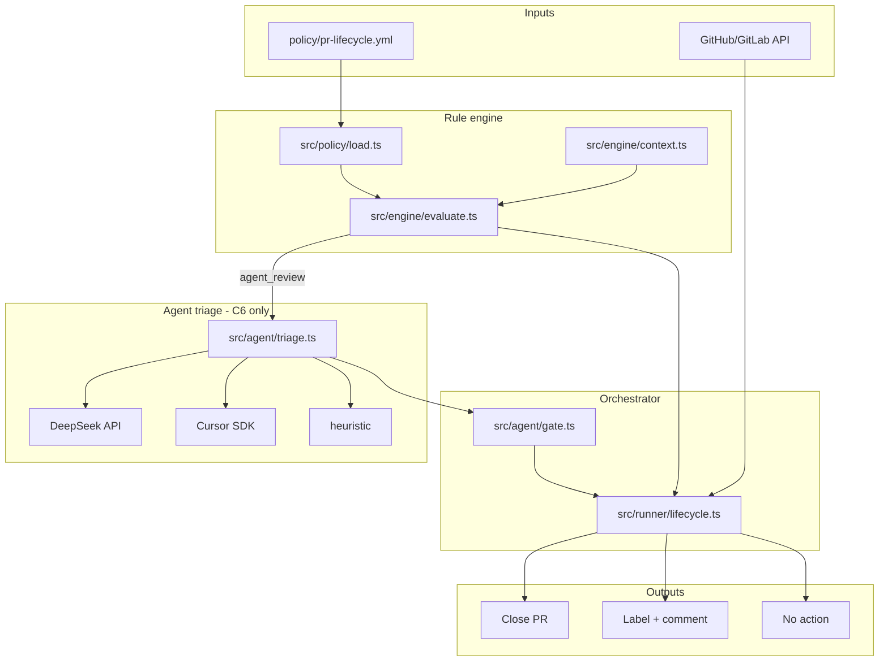
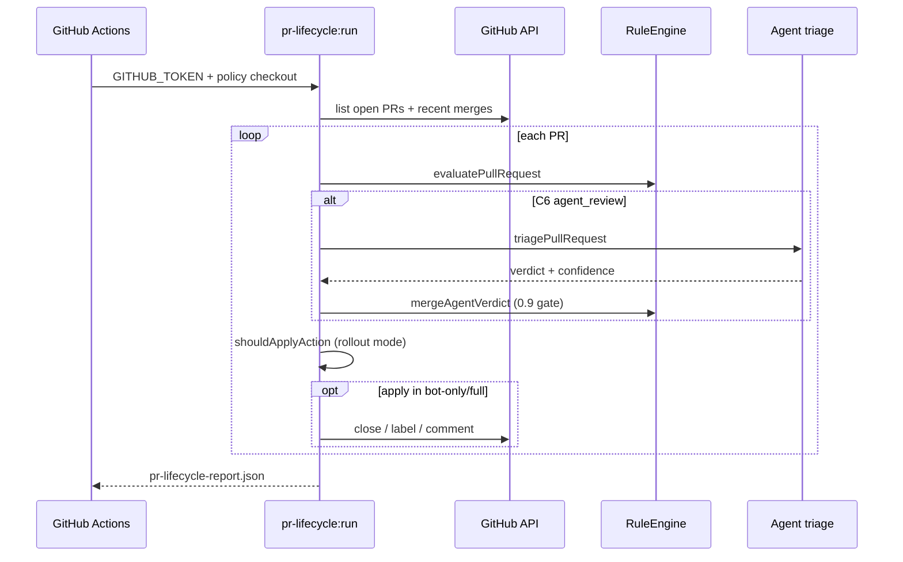
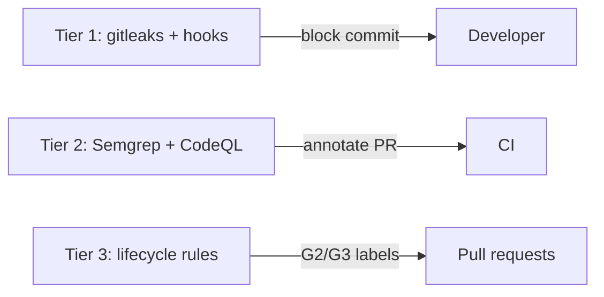

# Architecture

pr-steward evaluates open pull requests against `policy/pr-lifecycle.yml`, optionally triages ambiguous cases with an LLM, and applies close/warn actions via platform APIs (CI only for writes).

## Tech stack

- TypeScript (Node.js ≥20, ESM)
- Vitest
- YAML policy (`policy/pr-lifecycle.yml`)
- GitHub Actions + GitLab CI scaffold
- Gitleaks + Semgrep + CodeQL (tiered security)
- DeepSeek API (agent triage, optional)
- Cursor SDK (agent triage, optional)

## Component diagram

## Data flow

## Source modules

| Module | Role |
|--------|------|
| `src/agent/` | Heuristic + DeepSeek + Cursor triage for C6 |
| `src/cli/` | dry-run, run, curate-docs entrypoints |
| `src/curator/` | Documentation snapshot and generation |
| `src/engine/` | Rule evaluation and evaluation context |
| `src/fixtures/` | Sample PR data for dry-run |
| `src/platform/` | GitHub/GitLab clients and normalizers |
| `src/policy/` | YAML policy loader |
| `src/runner/` | Lifecycle orchestrator |

## CI workflows

| Workflow | Triggers |
|----------|----------|
| `ci.yml` (CI) | pull_request, push |
| `docs-curate.yml` (Docs Curate) | schedule, workflow_dispatch |
| `pr-lifecycle.yml` (PR Lifecycle) | schedule, workflow_dispatch |
| `security.yml` (Security) | workflow_dispatch, pull_request, push |

## Policy snapshot

- **Rollout:** `bot-only`
- **Rules:** E1, A2, C3, B3, G2, G3, A3, C6
- **Exemption labels:** `keep-open`, `blocked`, `do-not-close`, `hold`, `wip`

## Security architecture

## Docs curator

`src/curator/` scans the repo (Makefile, package.json, policy, workflows) → `docs/.curator-context.json` → template markdown. Optional DeepSeek pass when `DEEPSEEK_API_KEY` is set.

---
_Context: 2026-06-24T06:21:53.669Z_
